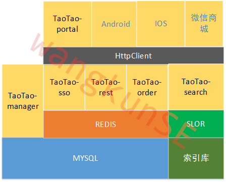

### 项目架构图

---

## 项目简介

&emsp;&emsp;该项目为一个电商项目的样例。类似京东商城。所有界面及流程都有参考。

&emsp;&emsp;该项目采用SOA架构，因此该项目可以采用分布式部署，有效地利用各种资源，各个模块又可以单独以集群部署。有良好的扩展性，稳定性。且采用了各种主流技术，如redis，slor，httpclient，nginx等等。确保功能的实现及性能的保证。

&emsp;&emsp;持续更新.....